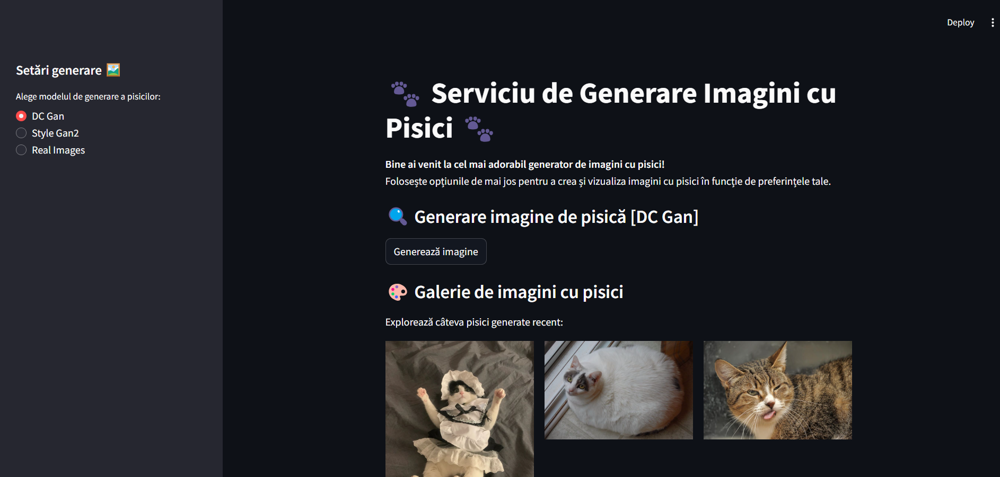

# DCGAN & StyleGAN2 Streamlit Interface


## Descriere

Acesta este un proiect care implementează o interfață Streamlit pentru un model de Generative Adversarial Network (GAN).
Proiectul include două arhitecturi populare pentru generarea de imagini sintetice: **DCGAN** (Deep Convolutional GAN) și
**StyleGAN2**. Interfața Streamlit permite utilizatorilor să exploreze și să vizualizeze imagini generate de aceste
modele.



## Instrucțiuni pentru Pornirea Proiectului

### 1. Creează un mediu virtual

Deschide terminalul și creează un mediu virtual pentru proiect:

```bash
python -m venv .venv
```

### 2. Activează mediul virtual

Pentru a activa mediul virtual, folosește următoarea comandă:

- **Pe Windows**:
  ```bash
  .\.venv\Scripts\activate
  ```

- **Pe macOS/Linux**:
  ```bash
  source .venv/bin/activate
  ```

### 3. Instalează Poetry

Poetry este un instrument de gestionare a dependențelor Python. Instalează-l cu comanda:

```bash
pip install poetry
```

### 4. Instalează dependențele

După instalarea Poetry, instalează toate dependențele necesare pentru proiect folosind:

```bash
poetry install
```

### 5. Rulează aplicația Streamlit

Pentru a porni interfața Streamlit, rulează următoarea comandă:

```bash
streamlit run app.py
```

Acum ar trebui să poți accesa aplicația ta pe browser, de obicei la adresa `http://localhost:8501`.

## Contribuții

Dacă dorești să contribui la acest proiect, te rugăm să deschizi un **Pull Request** sau să raportezi orice problemă
folosind secțiunea **Issues**.

